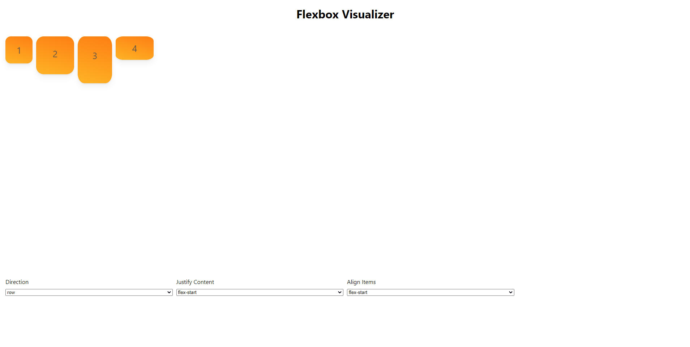

# Flexbox Visualizer

> Flexbox is the go-to way to create web layouts, this visualizer helps to see how different flex properties work with each other. Animations provided by Framer Motion.

## [Demo](https://flexbox-visualizer.netlify.app/)



## Development

Clone the repository and change dirctory to `flexbox-visualizer`
and install all the dependencies by running

```
npm install
```

To run the application in development mode run

```
npm start
```

Open [http://localhost:3000](http://localhost:3000) to view it in browser
